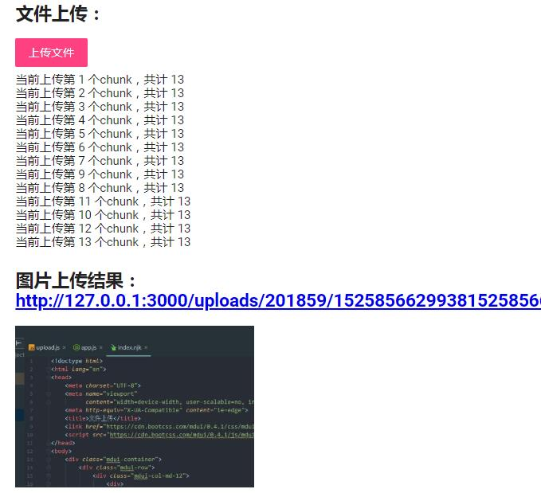

## axios-express-chunk-upload

基于 axios 和 express 的文件分片上传示例

### 一、使用方式

#### 1、克隆项目：
```bash
git clone https://github.com/postbird/axios-express-chunk-upload.git
```

#### 2、安装依赖：

```bash
yarn install
```

#### 3、启动项目：

```bash
node app.js
```

### 二、项目依赖：

后端基于express 4.X开发，使用如下依赖：

- `body-parser`: "^1.18.2",
- `express`: "^4.16.3",
- `multer`: "^1.3.0",
- `nunjucks`: "^3.1.2"

前端UI使用 [mdui](https://www.mdui.org)，axios 和 UI 均从[bootcdn](http://bootcdn.cn)引入


### 三、效果

